# Early Galaxy
Simple command-line tool for posting to Blogger. This script was written to enable posting to a blogger.com blog from the command line automatically. It is really a part of  which stopped working due to Google pulled the support for OAuth 1.0 and the  tool stopped working. To my suprise, no one has rewritten that tool as of March 2016 and therefore the need for this specific script. 

## Requirements
You will need to install the google-api using pip:

```bash
$ pip install --upgrade google-api-python-client
```

## Blogger API v3
The Blogger API v3 allows client applications to view and update Blogger content. Your client application can use Blogger API v3 to create new blog posts, edit or delete existing posts, and query for posts that match particular criteria.

To use this script with the Blogger API v3, you need to a generate OAuth 2.0 client ID. Refer to the API documentation for details. 

## Get started

Follow these steps to get up and running with the script. The project used in the example is not active and therefore the keys are not working.

1. Go to: https://console.developers.google.com/apis/credentials?project=_
2. Create a new project

    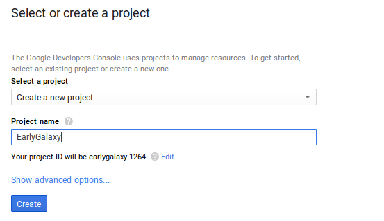

3. Enable Blogger API

    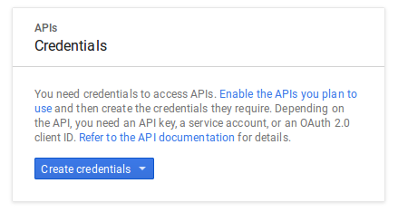
    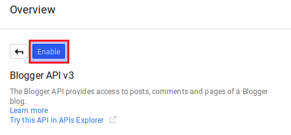

4. Create credentials (OAuth client ID)

    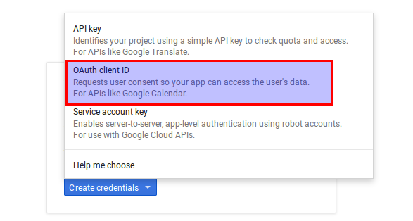
    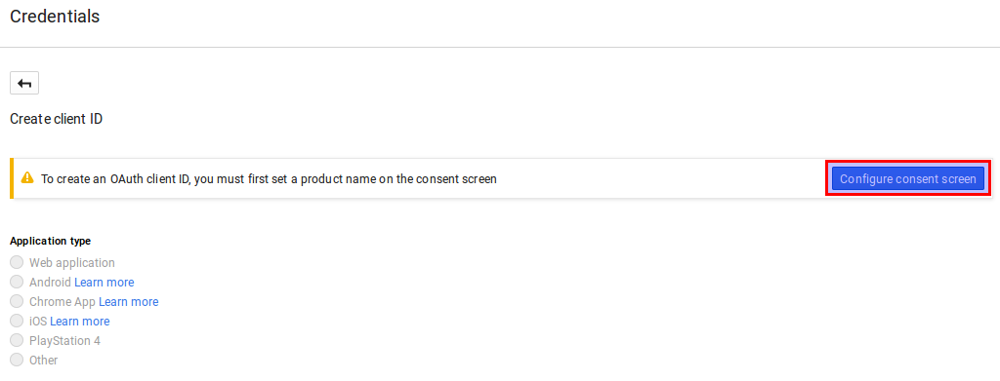
    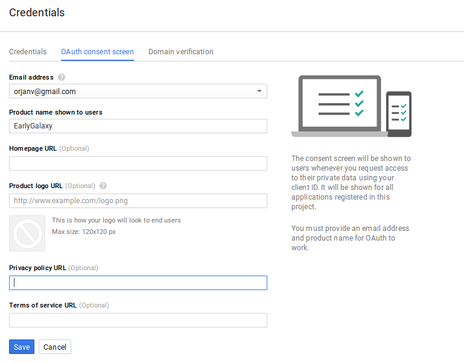
    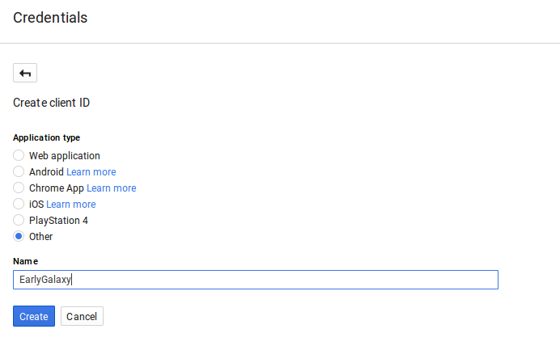
    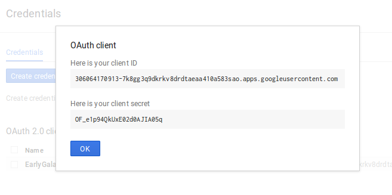
    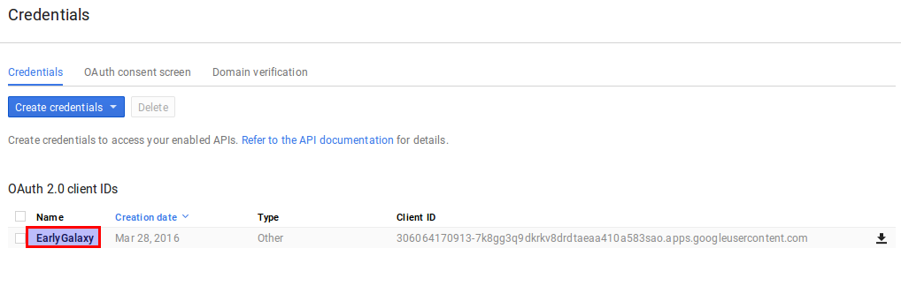

5. Download JSON and save as client_secrets.json in the same folder as the script

    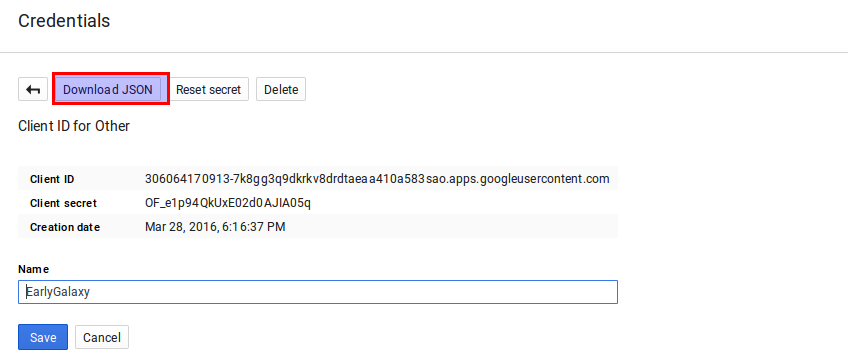

    If you want, you can format the JSON code using: 

    
    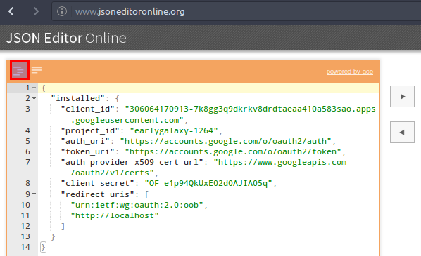

6. You also need to change the blogID at the beginning of the script to match the blog you want to post to. This ID is visible when you are logged into Blogger.com with your Google account.

    ```bash
    myblogid = 8032756911295504398
    ```

## Usage

To use the script, you need to run the script with a couple of arguments:

```bash
--title "Your blog post title"
--src <file containing your blogpost written in html>
```

an optional argument can be used

```bash
--label "labels, separated, by, comma" 
```

## Example

```bash
$ python blogger.py --title "Five nice haiku poems" --labels "haiku" --src haiku.html 
``` 

Enjoy posting from the command line!

